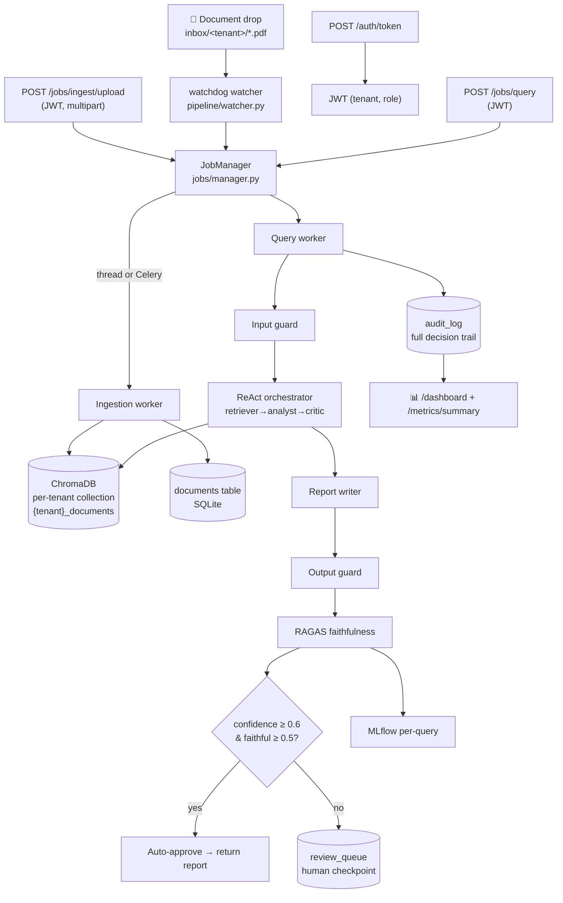

# Financial Document Analyst — Production, End-to-End

> A local-first, **multi-tenant** AI platform for **regulatory & financial document intelligence**.
> It ingests RBI / SEBI circulars, Basel III policy, and bank annual reports, answers questions with a
> cited multi-agent RAG pipeline, and wraps every query in the things a bank actually cares about:
> **auth, async jobs, audit trails, human review, and an ops dashboard.**

This started as a generic "AI Research Analyst" RAG demo. The feedback was *"make it end to end"* —
which, in a banking/enterprise context, means **data in → business value out, with everything in between
observable, recoverable, and auditable.** This repo is that upgrade. It still runs entirely on a laptop.

---

## 📚 Documentation map

Read these in order. The `understand_*` guides connect the **theory** to the **exact files** that implement it,
with block diagrams.

| Topic | How-to (run it) | Theory ↔ implementation |
| ----- | --------------- | ----------------------- |
| Whole system | this file | [docs/understand/understand_end_to_end_architecture.md](docs/understand/understand_end_to_end_architecture.md) |
| RAG core (standalone) | [docs/README_RAG.md](docs/README_RAG.md) | [docs/understand/understand_rag.md](docs/understand/understand_rag.md) |
| Multi-agent ReAct | [docs/README_RAG.md](docs/README_RAG.md) | [docs/understand/understand_multi_agent_react.md](docs/understand/understand_multi_agent_react.md) |
| Guardrails | [docs/README_API.md](docs/README_API.md) | [docs/understand/understand_guardrails.md](docs/understand/understand_guardrails.md) |
| Evaluation (RAGAS) | [docs/README_API.md](docs/README_API.md) | [docs/understand/understand_evaluation_ragas.md](docs/understand/understand_evaluation_ragas.md) |
| Auth + multi-tenancy | [docs/README_AUTH_TENANCY.md](docs/README_AUTH_TENANCY.md) | [docs/understand/understand_auth_jwt_multitenancy.md](docs/understand/understand_auth_jwt_multitenancy.md) |
| Async job queue | [docs/README_JOBS_ASYNC.md](docs/README_JOBS_ASYNC.md) | [docs/understand/understand_async_jobs.md](docs/understand/understand_async_jobs.md) |
| Data pipeline (watcher) | [docs/README_DATA_PIPELINE.md](docs/README_DATA_PIPELINE.md) | [docs/understand/understand_data_pipeline.md](docs/understand/understand_data_pipeline.md) |
| Audit + human review | [docs/README_AUDIT_REVIEW.md](docs/README_AUDIT_REVIEW.md) | [docs/understand/understand_audit_compliance.md](docs/understand/understand_audit_compliance.md) · [understand_human_in_the_loop.md](docs/understand/understand_human_in_the_loop.md) |
| Monitoring dashboard | [docs/README_DASHBOARD.md](docs/README_DASHBOARD.md) | [docs/understand/understand_observability.md](docs/understand/understand_observability.md) |
| HTTP API reference | [docs/README_API.md](docs/README_API.md) | — |

---

## Architecture (production)



> Legacy single-collection endpoints from the original demo (`/query`, `/ingest`, `/eval`, `/health`) are
> kept for backward compatibility. **New work uses the authenticated `/jobs/*` endpoints.**

---

## Run it on your laptop (no Docker, no Redis required)

The default job backend is an **in-process thread pool**, so you need *zero* extra
infrastructure to see the whole system work. SQLite stores all state in one file.

```bash
# 0. one-time
pip install -r requirements.txt
ollama pull mistral          # needs Ollama running: `ollama serve`

# 1. create an offline-safe financial PDF corpus (synthetic RBI/SEBI/Basel/annual report)
python -m scripts.make_financial_corpus

# 2. start the API (seeds tenants + users, builds the per-tenant pipeline)
uvicorn serve.api:app --port 8000
```

Then, in another terminal, drive it over HTTP (full walk-through in
[docs/README_API.md](docs/README_API.md)):

```bash
# log in as the risk-team analyst -> get a JWT
TOKEN=$(curl -s -X POST http://localhost:8000/auth/token \
  -d "username=bob&password=risk123" | python -c "import sys,json;print(json.load(sys.stdin)['access_token'])")

# upload a PDF -> returns a job_id (async)
curl -X POST http://localhost:8000/jobs/ingest/upload \
  -H "Authorization: Bearer $TOKEN" \
  -F "file=@sample_pdfs/financial/rbi_capital_adequacy_circular.pdf"

# ask a question -> returns a job_id immediately
curl -X POST http://localhost:8000/jobs/query \
  -H "Authorization: Bearer $TOKEN" -H "Content-Type: application/json" \
  -d '{"question":"What is the minimum CRAR a bank must maintain?"}'

# poll the job (or stream the ReAct trace at /jobs/{id}/stream)
curl http://localhost:8000/jobs/<job_id> -H "Authorization: Bearer $TOKEN"
```

Open the **ops dashboard** at <http://localhost:8000/dashboard> (sign in with
`bob` / `risk123`).

### Seeded logins (dev defaults — change in production)

| Username   | Password    | Tenant        | Role     |
| ---------- | ----------- | ------------- | -------- |
| `alice`    | `retail123` | `retail-bank` | analyst  |
| `bob`      | `risk123`   | `risk-team`   | analyst  |
| `reviewer` | `review123` | `risk-team`   | reviewer |

### The watched-folder pipeline (optional, separate terminal)

```bash
python -m scripts.make_financial_corpus --to-inbox risk-team   # drop PDFs for the watcher
python -m pipeline.watch                                        # auto-ingests inbox/<tenant>/*.pdf
```

### Just the RAG core, standalone (no API/auth/jobs)

```bash
python -m standalone.rag_minimal ingest --dir sample_pdfs/financial
python -m standalone.rag_minimal ask --question "Summarise the risk disclosures."
```

### Scale-out with Celery + Redis + Docker (optional)

See [docs/README_JOBS_ASYNC.md](docs/README_JOBS_ASYNC.md). In short:
`set JOB_BACKEND=celery`, start Redis, start a worker, start the API.

---

## Legacy quick demo

```bash
python demo.py
```

The original demo downloads two ArXiv papers, ingests them, and runs five
questions end-to-end with ReAct traces, guardrail results, and RAGAS scores. It
uses the legacy single-collection path and still works.

---

## CLI Usage

```bash
# Ingest one or more PDFs into the vector store
python main.py ingest --pdfs paper1.pdf paper2.pdf

# Ask a research question (full guardrails + RAGAS + MLflow)
python main.py query --question "What is attention?"

# Run a batch RAGAS evaluation (omit --questions to use the golden set)
python main.py eval
python main.py eval --questions "What problem does this address?" "What are the limitations?"
```

---

## API Usage

```bash
uvicorn serve.api:app --reload --port 8000
```

Interactive docs are served at `http://localhost:8000/docs`.

**Health**

```bash
curl http://localhost:8000/health
```

**Ingest server-side PDFs**

```bash
curl -X POST http://localhost:8000/ingest \
  -H 'Content-Type: application/json' \
  -d '{"pdf_paths": ["sample_pdfs/rag_paper.pdf"]}'
```

**Upload a PDF (multipart) and ingest it**

```bash
curl -X POST http://localhost:8000/ingest/upload \
  -F "file=@/path/to/paper.pdf"
```

**Query**

```bash
curl -X POST http://localhost:8000/query \
  -H 'Content-Type: application/json' \
  -d '{"question": "What is attention?", "include_trace": true, "include_eval": true}'
```

**Evaluate**

```bash
curl -X POST http://localhost:8000/eval \
  -H 'Content-Type: application/json' \
  -d '{"questions": ["What are the key results?", "What are the limitations?"]}'
```

| Method | Path              | Purpose                                        |
| ------ | ----------------- | ---------------------------------------------- |
| GET    | `/health`         | Liveness + vector store count + model name     |
| POST   | `/ingest`         | Ingest PDFs already present on the server disk  |
| POST   | `/ingest/upload`  | Upload a PDF (multipart) then ingest it        |
| POST   | `/query`          | Full pipeline: guards → ReAct → report → RAGAS |
| POST   | `/eval`           | Batch RAGAS evaluation, saves a JSON report    |
| GET    | `/trace/{run_id}` | Placeholder pointer to the MLflow UI           |

---

## Docker

```bash
docker compose up --build
```

This starts three services:

- **api** — the FastAPI app on `http://localhost:8000`
- **ollama** — the LLM runtime on `http://localhost:11434`
- **mlflow** — the MLflow tracking UI on `http://localhost:5000`

> **First run:** the `ollama` image starts without any models. Pull `mistral`
> once (this may take a few minutes):
>
> ```bash
> docker compose exec ollama ollama pull mistral
> ```

The `OLLAMA_BASE_URL=http://ollama:11434` environment variable in
`docker-compose.yml` overrides the config so the API talks to the Ollama
container instead of `localhost`.

---

## Design Decisions (the "why this stack" questions)

The short version is below; each `understand_*` doc has the long version.

- **Why custom ReAct over LangGraph** — Full control over the state machine,
  easier to debug and explain, no hidden abstractions. Every
  Thought/Action/Observation is plain Python we can inspect, log, and **audit**.

- **Why hybrid retrieval (dense + BM25 + RRF)** — Dense misses exact keyword
  matches (e.g. "CET1", "CRAR"); BM25 misses semantic similarity. Reciprocal Rank
  Fusion gets the best of both without tuning a brittle weighted sum.

- **Why a cross-encoder reranker** — Bi-encoder retrieval is fast but
  approximate. A cross-encoder scores query–chunk pairs jointly for much higher
  top-N precision — worth the latency on regulatory text where wording matters.

- **Why SQLite + SQLAlchemy (not Postgres) for state** — "Runs on my laptop."
  SQLite is zero-install, one file, inspectable. Because everything goes through
  the SQLAlchemy ORM, switching to Postgres is a one-line URL change.

- **Why a thread job backend by default (not always Celery)** — Same async API
  contract (submit → poll → stream) with **nothing to install**. `JOB_BACKEND=celery`
  swaps in Redis + workers for real horizontal scale without changing endpoints.

- **Why JWT (python-jose) + passlib** — Stateless, expiring tokens carrying
  `tenant` + `role`, so a worker or a second replica verifies them with only the
  shared secret — no session store. OIDC-shaped so a real IdP can replace it.

- **Why a separate audit log (not "just MLflow")** — MLflow answers *"how is the
  model doing over time?"*; the audit log answers *"what exactly did the system do
  for query X, and who asked it?"*. Banks need the second one for compliance.

- **Why human-in-the-loop on low confidence** — No LLM output reaches a user on a
  low-confidence/low-faithfulness case without a human checkpoint. That is exactly
  how production GenAI at banks works.

---

## What the feedback asked for → what was added

| Gap identified                | What was built                                              | Where |
| ----------------------------- | ---------------------------------------------------------- | ----- |
| Generic use case              | Financial document corpus + topic-anchored guard            | `scripts/`, `configs/config.yaml` |
| No async / job handling       | Job queue (thread default, Celery+Redis optional) + SSE     | `jobs/` |
| No multi-tenancy              | JWT auth + per-tenant Chroma collections                    | `auth/`, `tenancy/` |
| No data pipeline              | watchdog folder watcher + `documents` metadata table        | `pipeline/`, `db/` |
| No auditability              | Structured `audit_log` with the full decision trail         | `audit/`, `db/` |
| No human oversight            | `review_queue` for low-confidence reports                   | `serve/routers/review.py` |
| No observability             | Chart.js ops dashboard over real metrics                    | `serve/static/`, `serve/routers/metrics.py` |

### Still future work

- Redis pub/sub stream bus so SSE works under the Celery backend too
- Fine-tuned cross-encoder on domain query–chunk pairs
- Pinecone/Weaviate swap for a managed vector store
- Real OIDC issuer (Keycloak) instead of seeded users

---

## Project Structure

```
research_analyst/
├── ingestion/                # chunker · embedder · ChromaDB vector store
├── retrieval/                # dense · sparse(BM25) · RRF + cross-encoder rerank
├── agents/                   # ReAct orchestrator + retriever/analyst/critic + report writer
├── guardrails/               # input (injection/PII/topic) + output (grounding/toxicity)
├── eval/                     # RAGAS metrics + golden set
│
├── db/                       # 🆕 SQLAlchemy: tenants/users/documents/jobs/audit/review
├── auth/                     # 🆕 JWT (jose) + passlib + seed + FastAPI deps
├── tenancy/                  # 🆕 per-tenant pipeline registry (shared heavy models)
├── core/                     # 🆕 tenant-aware query/ingest service (audit + review wiring)
├── audit/                    # 🆕 structured audit logging + review resolution
├── jobs/                     # 🆕 async queue: store · stream(SSE) · runners · thread/celery
├── pipeline/                 # 🆕 watchdog folder watcher + standalone `watch` entrypoint
│
├── serve/
│   ├── api.py                # FastAPI app (lifespan wires the whole stack)
│   ├── state.py              # 🆕 shared app state for routers
│   ├── routers/              # 🆕 auth · jobs · documents · review · metrics
│   ├── static/dashboard.html # 🆕 Chart.js ops dashboard
│   ├── schemas.py · middleware.py
│
├── standalone/rag_minimal.py # 🆕 self-contained runnable RAG (no API/auth/jobs)
├── scripts/                  # 🆕 financial corpus generator + real-PDF downloader
├── docs/                     # 🆕 README_* how-tos + understand_* theory↔code guides
│
├── configs/config.yaml       # all settings (pipeline + serve + auth + jobs + review)
├── main.py · demo.py · mlflow_tracker.py
├── Dockerfile · docker-compose.yml   # api + worker + redis + ollama + mlflow
└── requirements.txt
```


