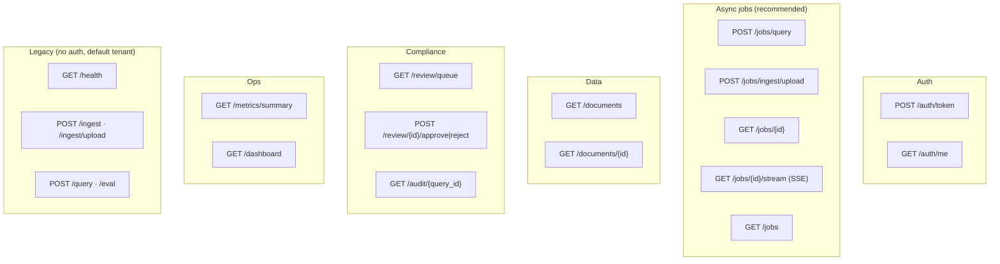

# README — HTTP API Reference

Start the server, then browse interactive docs at <http://localhost:8000/docs>.

```bash
uvicorn serve.api:app --port 8000
```

Everything under `/jobs`, `/documents`, `/review`, `/metrics`, `/audit`, and
`/auth/me` requires a **JWT** (`Authorization: Bearer <token>`). Get one from
`POST /auth/token`. The legacy `/query`, `/ingest`, `/eval`, `/health` endpoints
are unauthenticated and operate on the shared `default` tenant collection
(kept for backward compatibility with the original demo).

---

## Endpoint map



---

## Auth

| Method | Path | Body | Returns |
| ------ | ---- | ---- | ------- |
| POST | `/auth/token` | form `username`,`password` | `{access_token, tenant_id, role}` |
| GET | `/auth/me` | — | identity from the token |

## Async jobs (recommended path)

| Method | Path | Purpose |
| ------ | ---- | ------- |
| POST | `/jobs/query` | `{question, include_eval}` → `job_id` (202) |
| POST | `/jobs/ingest/upload` | multipart PDF → `job_id` (202) |
| GET | `/jobs/{id}` | poll status/result |
| GET | `/jobs/{id}/stream` | SSE ReAct trace |
| GET | `/jobs` | list recent tenant jobs |

## Documents · Review · Audit · Metrics

| Method | Path | Role | Purpose |
| ------ | ---- | ---- | ------- |
| GET | `/documents` | any | list ingested docs (tenant) |
| GET | `/documents/{id}` | any | one doc's metadata |
| GET | `/review/queue` | reviewer | pending flagged reports |
| GET | `/review/{query_id}` | reviewer | full withheld report |
| POST | `/review/{query_id}/approve` | reviewer | approve |
| POST | `/review/{query_id}/reject` | reviewer | reject |
| GET | `/audit/{query_id}` | any (tenant) | full compliance record |
| GET | `/metrics/summary` | any | dashboard JSON |
| GET | `/dashboard` | public | ops dashboard HTML |

## Legacy (unauthenticated, `default` tenant)

| Method | Path | Purpose |
| ------ | ---- | ------- |
| GET | `/health` | liveness + vector count + model |
| POST | `/ingest` | ingest server-side PDF paths |
| POST | `/ingest/upload` | upload + ingest a PDF |
| POST | `/query` | synchronous full pipeline |
| POST | `/eval` | batch RAGAS evaluation |

---

## Guardrails & evaluation (run on every query)

These are not separate endpoints — they run **inside** the pipeline:

- **Input guard** (`guardrails/input_guard.py`): injection → PII → topic
  relevance. Fails fast before any LLM call. See
  [understand_guardrails.md](understand/understand_guardrails.md).
- **Output guard** (`guardrails/output_guard.py`): citation grounding (cosine) →
  toxicity → citations present.
- **RAGAS** (`eval/ragas_eval.py`): faithfulness / answer relevance / context
  precision, logged to MLflow and the audit log. See
  [understand_evaluation_ragas.md](understand/understand_evaluation_ragas.md).
