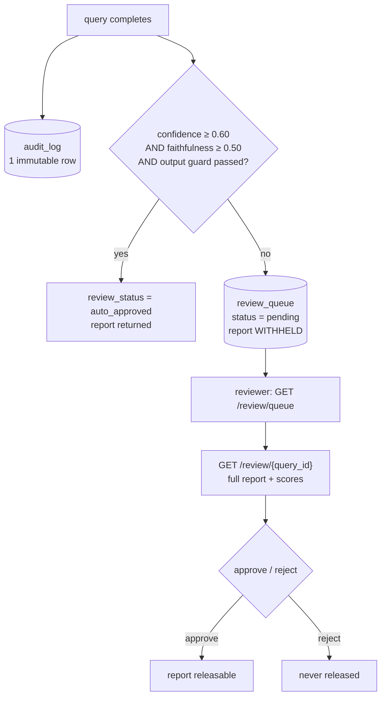

# README — Audit Log & Human-in-the-Loop Review

The two compliance features banks care about most. Theory ↔ code:
[understand_audit_compliance.md](understand/understand_audit_compliance.md) and
[understand_human_in_the_loop.md](understand/understand_human_in_the_loop.md).

---

## The flow



---

## Audit log — what's recorded

Every query writes **one** row to `audit_log` (`db/models.py`, written by
`audit/logger.py`):

```
query_id, tenant_id, user_id, username, question,
input_guard_passed, input_guard_json, react_steps_json,
retrieved_chunk_ids_json, final_report, output_guard_passed,
ragas_faithfulness, confidence_score, review_status, latency_ms, created_at
```

This is **separate from MLflow on purpose**: MLflow = ML experiment tracking;
audit log = compliance + debugging. An auditor pulls any `query_id` and sees the
complete decision trail.

```bash
curl http://localhost:8000/audit/<query_id> -H "Authorization: Bearer $TOKEN"
```

The `query_id` equals the `job_id` — one identifier ties the job, its trace, and
its compliance record together.

---

## Human review — low-confidence checkpoint

A report is flagged (held back) when **any** of these is true (thresholds in
`config['review']`):

- `confidence_score < 0.60` (from the report writer's self-scored confidence)
- `ragas_faithfulness < 0.50`
- the output guard flagged it (ungrounded claims / missing citations)

When flagged, the report is **not** returned to the requester; it goes to
`review_queue`. Only the `reviewer`/`admin` role can act.

```bash
# as the reviewer (bob's tenant has a 'reviewer' user)
RTOKEN=$(curl -s -X POST http://localhost:8000/auth/token \
  -d "username=reviewer&password=review123" | python -c "import sys,json;print(json.load(sys.stdin)['access_token'])")

curl http://localhost:8000/review/queue -H "Authorization: Bearer $RTOKEN"
curl http://localhost:8000/review/<query_id> -H "Authorization: Bearer $RTOKEN"

curl -X POST http://localhost:8000/review/<query_id>/approve \
  -H "Authorization: Bearer $RTOKEN" -H "Content-Type: application/json" \
  -d '{"comment":"Verified against the source circular."}'
```

| Endpoint | Role | Purpose |
| -------- | ---- | ------- |
| GET `/review/queue` | reviewer | List pending flagged reports |
| GET `/review/{query_id}` | reviewer | Full withheld report + scores |
| POST `/review/{query_id}/approve` | reviewer | Approve → releasable |
| POST `/review/{query_id}/reject` | reviewer | Reject → never released |

Approving/rejecting also updates the matching `audit_log.review_status`, keeping
the compliance record consistent.
