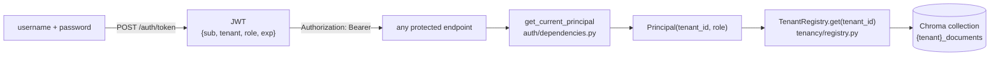

# README — Authentication & Multi-Tenancy

How to log in, how tenant isolation works, and how to run it. Theory ↔ code:
[understand_auth_jwt_multitenancy.md](understand/understand_auth_jwt_multitenancy.md).

---

## The model



- **One tenant per user.** The token carries `tenant` and `role`, so scoping is
  derived from verified claims — no DB lookup on the hot path.
- **Hard isolation at the vector store.** Each tenant has its own ChromaDB
  collection `{tenant}_documents`. A `retail-bank` user physically cannot retrieve
  a `risk-team` chunk.

| Concern | File | Library / choice |
| ------- | ---- | ---------------- |
| Password hashing | `auth/security.py` | `passlib[bcrypt]` |
| Token mint/verify | `auth/security.py` | `python-jose` (HS256) |
| Request dependency | `auth/dependencies.py` | FastAPI `OAuth2PasswordBearer` |
| Seed tenants/users | `auth/seed.py` | from `config['auth']` |
| Per-tenant pipeline | `tenancy/registry.py` | shared models, per-tenant store |

---

## Seeded logins (dev defaults)

| Username   | Password    | Tenant        | Role     |
| ---------- | ----------- | ------------- | -------- |
| `alice`    | `retail123` | `retail-bank` | analyst  |
| `bob`      | `risk123`   | `risk-team`   | analyst  |
| `reviewer` | `review123` | `risk-team`   | reviewer |

These are created on first startup by `seed_auth()`. Edit them in
`configs/config.yaml` under `auth.seed_users`.

---

## Run / try it

```bash
# get a token
curl -X POST http://localhost:8000/auth/token -d "username=bob&password=risk123"

# use it
TOKEN=...   # the access_token field above
curl http://localhost:8000/auth/me -H "Authorization: Bearer $TOKEN"
```

In Swagger (<http://localhost:8000/docs>) click **Authorize** and paste the token —
all protected endpoints then work in the browser.

### Prove tenant isolation

1. Log in as `alice` (retail-bank), ingest a PDF, ask a question → works.
2. Log in as `bob` (risk-team), ask the same question → **no results from
   alice's document**, because `bob` queries `risk-team_documents`.

---

## Production hardening checklist

- Set `JWT_SECRET_KEY` env var (never use the default secret).
- Shorten `access_token_expire_minutes` and add refresh tokens.
- Replace seeded users with a real IdP (OIDC) — the token shape already matches.
- Add rate limiting + account lockout on `/auth/token`.
