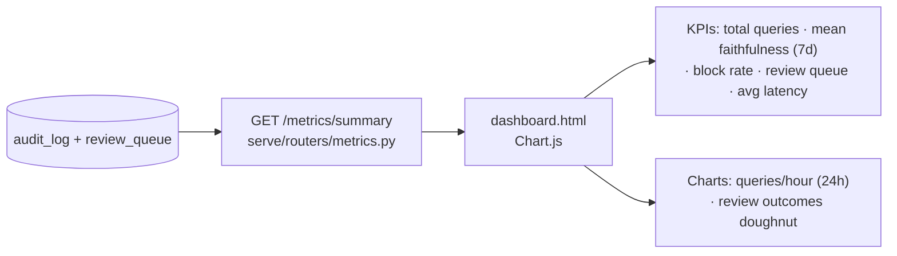

# README — Monitoring Dashboard

A single-file Chart.js ops dashboard over real metrics from the audit log. Theory
↔ code: [understand_observability.md](understand/understand_observability.md).

---

## What it shows



- **Queries per hour** (last 24h) — bar chart
- **Mean RAGAS faithfulness** (last 7d) — KPI
- **Input guard block rate** — KPI
- **Human review queue length** — KPI
- **Average latency per query** — KPI
- **Review outcomes** (auto_approved / pending / approved / rejected) — doughnut

All metrics are **tenant-scoped** to the signed-in user.

**Why a single HTML file + Chart.js (CDN):** zero build step, nothing to install,
one file you can screen-share. It is served by FastAPI as a static route, so the
"ops dashboard" is part of the same deployable.

---

## Run it

```bash
uvicorn serve.api:app --port 8000
# then open:
```

<http://localhost:8000/dashboard>

Sign in inside the page (default `bob` / `risk123`), click **Refresh**. The page
calls `/auth/token` then `/metrics/summary` and renders the charts. The JWT is
kept in `localStorage` for convenience.

> Run a few `/jobs/query` requests first so there is data to chart. Low-confidence
> answers will appear in the **Review Queue** KPI and the review doughnut.

| Endpoint | Purpose |
| -------- | ------- |
| GET `/dashboard` | Serves the HTML dashboard |
| GET `/metrics/summary` | JSON the dashboard charts (tenant-scoped) |
