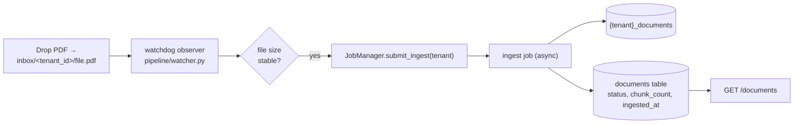

# README — Data Pipeline (Watched Folder)

Replaces the manual `python main.py ingest --pdfs ...` step with an event-driven
pipeline that has **state**. Theory ↔ code:
[understand_data_pipeline.md](understand/understand_data_pipeline.md).

---

## How it works



- The **first path segment** under `inbox/` is the tenant id, so
  `inbox/risk-team/foo.pdf` ingests into the `risk-team` collection.
- A size-stability check waits for the upload to finish before ingesting.
- Every document gets a row in the `documents` table tracking
  `pending → ingesting → ingested | failed`, `chunk_count`, and `ingested_at`.

**Why watchdog:** native OS filesystem events (no polling latency, no busy loop),
cross-platform — important for "runs on my laptop".

---

## Run it (separate terminal from the API)

```bash
# generate sample PDFs straight into the watched folder for risk-team
python -m scripts.make_financial_corpus --to-inbox risk-team

# start the watcher (builds the registry + a thread-backed job manager)
python -m pipeline.watch
```

Now drop any PDF into `inbox/<tenant_id>/` and watch it auto-ingest. Stop with
Ctrl+C.

> The watcher is an **independent long-running service** (its own process). It
> does not need the API server running. In production this is a separate
> deployable.

---

## Inspect ingested documents

```bash
curl http://localhost:8000/documents -H "Authorization: Bearer $TOKEN"
```

Returns, per tenant:

```json
[{ "id": "…", "filename": "rbi_…pdf", "status": "ingested",
   "chunk_count": 14, "ingested_at": "2026-…" }]
```

| Endpoint | Purpose |
| -------- | ------- |
| GET `/documents` | List the tenant's ingested documents + status |
| GET `/documents/{id}` | One document's metadata |
