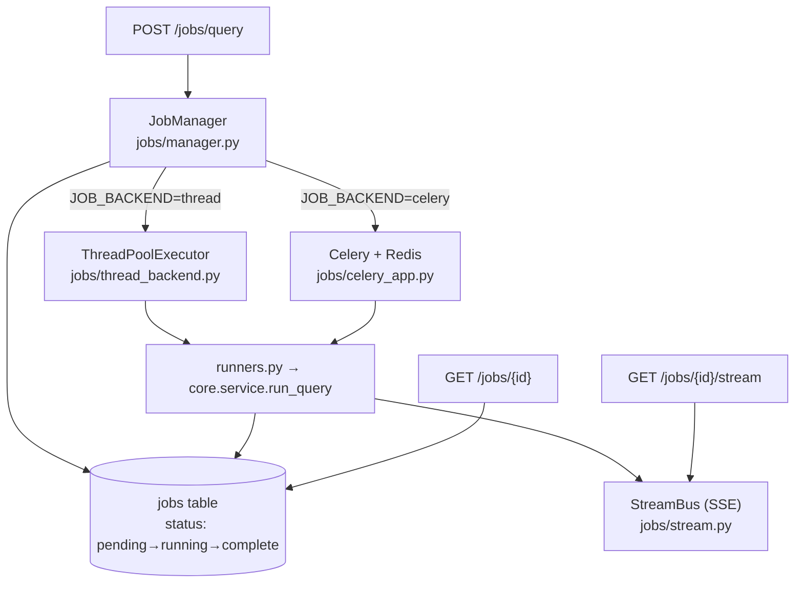

# README — Async Job Queue (the biggest "end to end" gap)

Production systems never block the caller for a long-running agent task. Here a
query/ingest returns a `job_id` immediately; work happens on a worker; the client
polls or streams. Theory ↔ code:
[understand_async_jobs.md](understand/understand_async_jobs.md).

---

## Two backends, one contract



| Backend | When | Infra needed | Streaming |
| ------- | ---- | ------------ | --------- |
| `thread` (default) | laptop / single box | none | ✅ live SSE |
| `celery` | scale-out | Redis + worker process | ⚠️ trace on completion* |

\* The in-memory `StreamBus` lives in the API process. Under Celery the worker is
a separate process, so live token streaming would need a Redis pub/sub bus
(future work). The full trace is always available via `GET /jobs/{id}` and the
audit log.

**Why this design:** identical submit→poll→stream API regardless of backend, so
you develop on the thread backend and deploy on Celery with no endpoint changes.

---

## Run — thread backend (default, nothing to install)

```bash
uvicorn serve.api:app --port 8000     # JOB_BACKEND defaults to "thread"

# submit a query → returns {job_id, poll_url, stream_url}
curl -X POST http://localhost:8000/jobs/query \
  -H "Authorization: Bearer $TOKEN" -H "Content-Type: application/json" \
  -d '{"question":"What is the minimum CRAR?"}'

# poll
curl http://localhost:8000/jobs/<job_id> -H "Authorization: Bearer $TOKEN"

# stream the ReAct trace live (Server-Sent Events)
curl -N http://localhost:8000/jobs/<job_id>/stream -H "Authorization: Bearer $TOKEN"
```

---

## Run — Celery + Redis backend (scale-out)

```bash
# 1. Redis (Docker is easiest)
docker run -p 6379:6379 redis:7-alpine

# 2. a worker — Windows MUST use --pool=solo
set JOB_BACKEND=celery
celery -A jobs.celery_app.celery_app worker --loglevel=info --pool=solo

# 3. the API, also pointed at celery
set JOB_BACKEND=celery
uvicorn serve.api:app --port 8000
```

Or all-in-one with Docker Compose (`docker compose up --build`) after setting
`JOB_BACKEND=celery` on both the `api` and `worker` services.

**Windows note:** Celery's default prefork pool does not work on Windows; always
pass `--pool=solo` (single-process) locally. On Linux/containers the default pool
is fine.

---

## Endpoints

| Method | Path | Purpose |
| ------ | ---- | ------- |
| POST | `/jobs/query` | Queue a query → `job_id` (202) |
| POST | `/jobs/ingest/upload` | Upload a PDF → queue ingestion → `job_id` (202) |
| GET | `/jobs/{id}` | Poll status + result (tenant-scoped) |
| GET | `/jobs` | List recent jobs for the tenant |
| GET | `/jobs/{id}/stream` | SSE stream of the ReAct trace |
