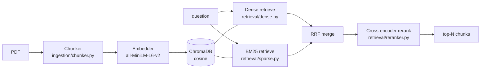
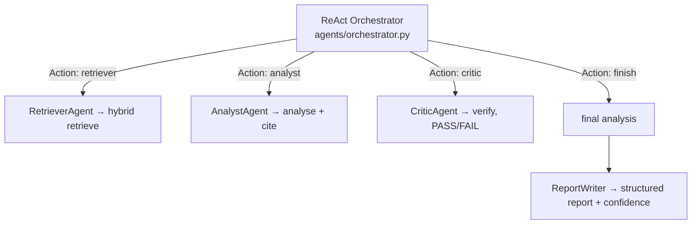

# README — RAG Core & Multi-Agent ReAct

How to run and reason about the retrieval pipeline and the agent loop that sits
on top of it. For theory ↔ code mapping see
[understand_rag.md](understand/understand_rag.md) and
[understand_multi_agent_react.md](understand/understand_multi_agent_react.md).

---

## What the RAG core does



| Stage | File | Choice & why |
| ----- | ---- | ------------ |
| Chunking | `ingestion/chunker.py` | Sentence-aware (PyMuPDF) so citations map to pages |
| Embeddings | `ingestion/embedder.py` | `all-MiniLM-L6-v2` — small, CPU-friendly, strong recall |
| Vector store | `ingestion/vector_store.py` | ChromaDB persistent, cosine — local, no server |
| Sparse | `retrieval/sparse.py` | BM25 — exact keyword match (e.g. "CRAR", "CET1") |
| Fusion | `retrieval/reranker.py` | Reciprocal Rank Fusion — no weight tuning |
| Rerank | `retrieval/reranker.py` | `ms-marco-MiniLM` cross-encoder — precision on top-N |

---

## Run the RAG core standalone (no API, no auth, no agents)

This is the simplest way to see retrieval working end to end.

```bash
# ingest a folder (or specific files) into a dedicated 'standalone_rag' collection
python -m standalone.rag_minimal ingest --dir sample_pdfs/financial
python -m standalone.rag_minimal ingest --pdfs report1.pdf report2.pdf

# one-shot question
python -m standalone.rag_minimal ask --question "What is the minimum CRAR?"

# interactive loop
python -m standalone.rag_minimal chat
```

Requires Ollama (`ollama serve` + `ollama pull mistral`). Everything else is CPU.

The standalone script (`standalone/rag_minimal.py`) deliberately uses **only** the
ingestion + retrieval modules and a direct Ollama call — no agents, guardrails,
DB, or auth — so you can study the pure RAG path in isolation.

---

## The multi-agent ReAct layer (on top of RAG)



The orchestrator is a **pure-Python Thought/Action/Observation loop** (no
LangGraph). Each step prints and is recorded in a `trace`, which the audit log
stores and the SSE endpoint streams. See
[understand_multi_agent_react.md](understand/understand_multi_agent_react.md).

Run a full agentic query through the API:

```bash
curl -X POST http://localhost:8000/jobs/query \
  -H "Authorization: Bearer $TOKEN" -H "Content-Type: application/json" \
  -d '{"question":"Summarise the risk disclosures in the annual report."}'
```

---

## Sample financial questions to try

- "What is the minimum Capital to Risk-weighted Assets Ratio (CRAR)?"
- "What is the Capital Conservation Buffer requirement?"
- "What does the Liquidity Coverage Ratio require?"
- "Summarise the credit risk disclosures in the annual report."
- "What are the SEBI continuous disclosure requirements for material events?"
