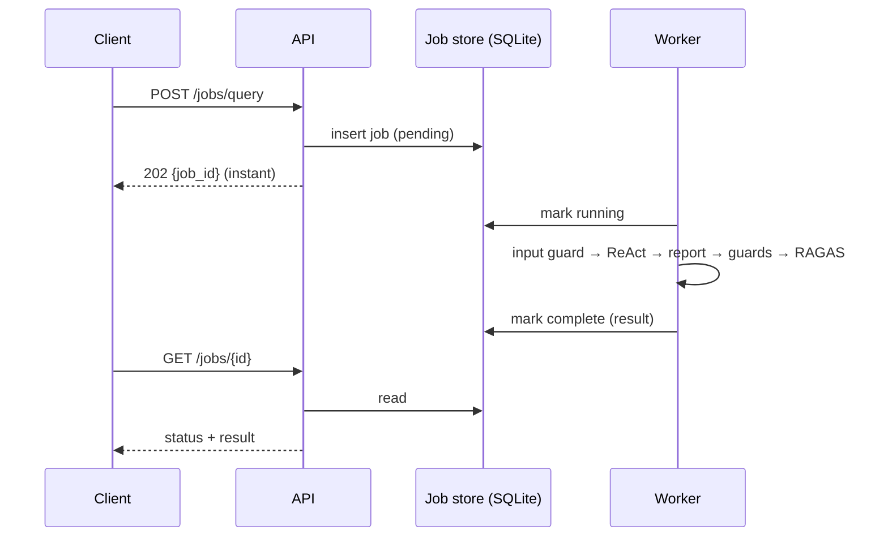
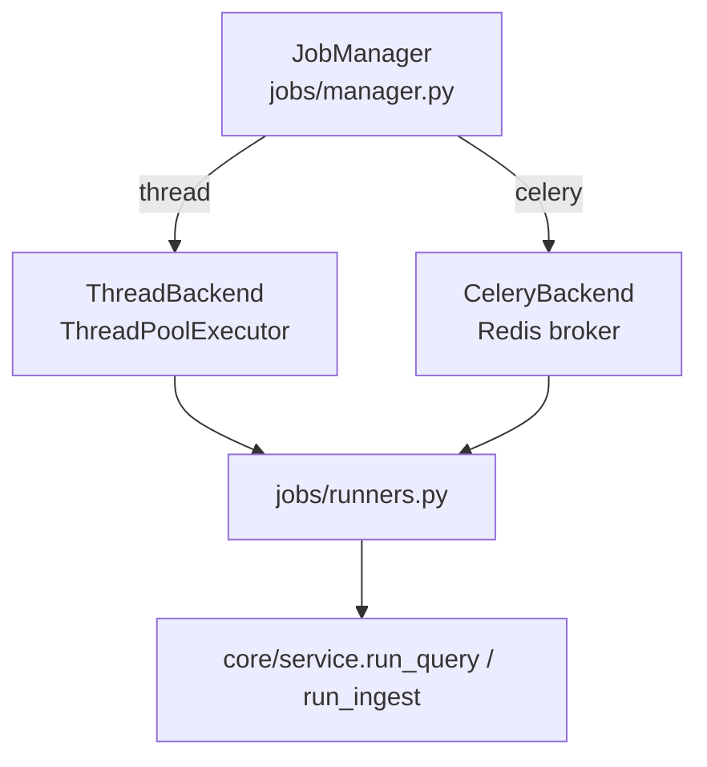
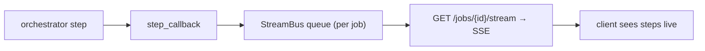

# Understand — Asynchronous Job Processing

> Why production never blocks the caller, and how the two backends implement the
> same contract.

---

## 1. The problem with synchronous agents

A ReAct query can take many seconds (multiple LLM calls). If the HTTP request
blocks until it finishes:

- the client connection is held open (timeouts, retries duplicate work),
- the server thread is tied up (poor throughput),
- you can't show progress.

**Solution: decouple submission from execution** with a job queue.



This is the **producer/consumer** pattern: the API *produces* jobs; workers
*consume* them. The DB is the durable queue + status board.

---

## 2. Two backends, one interface — `jobs/`



| | Thread backend (default) | Celery backend |
| --- | --- | --- |
| File | `jobs/thread_backend.py` | `jobs/celery_app.py` |
| Infra | none (in-process pool) | Redis + worker process |
| Concurrency | `thread_workers` (config) | worker `--concurrency` |
| Best for | laptop, single box | horizontal scale-out |
| Switch | `JOB_BACKEND=thread` | `JOB_BACKEND=celery` |

**Why both:** the `JobManager` exposes `submit_query` / `submit_ingest` /
`get_job`. Endpoints never know which backend runs — so you develop locally on
threads and deploy on Celery **without changing endpoint code**. That is the
abstraction that makes "runs on my laptop" and "scales in prod" both true.

### Thread backend (theory)

A `ThreadPoolExecutor` runs the (mostly I/O-bound: LLM HTTP calls) jobs
concurrently. Python's GIL is fine here because the work waits on network/LLM, not
CPU. Status is persisted to SQLite so a poll always sees the latest state.

### Celery backend (theory)

Celery is a distributed task queue: tasks are serialised to a **broker** (Redis),
workers pull and execute them, results go to a **result backend**. Workers are
separate processes/machines → true horizontal scaling.

> **Windows:** Celery's prefork pool doesn't work on Windows; use `--pool=solo`.

---

## 3. Streaming the ReAct trace (SSE) — `jobs/stream.py`

**Server-Sent Events** is a one-way HTTP stream (text/event-stream). The query
runner passes a `step_callback` into the orchestrator; each ReAct step is
published to an in-process `StreamBus`; `GET /jobs/{id}/stream` drains it and
emits events.



**Scope:** the bus is in the API process → live streaming works with the **thread**
backend. Under **Celery** the worker is a different process, so live streaming
needs a Redis pub/sub bus (future work) — but the full trace is always available
on completion via `GET /jobs/{id}` and the audit log.

---

## 4. The job lifecycle (`jobs/store.py`)

```
pending → running → complete | failed
```

Each transition is a row update in the `jobs` table, with `payload_json`,
`result_json`, timestamps, and tenant ownership (enforced on read).
