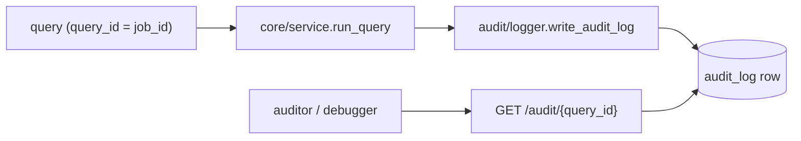
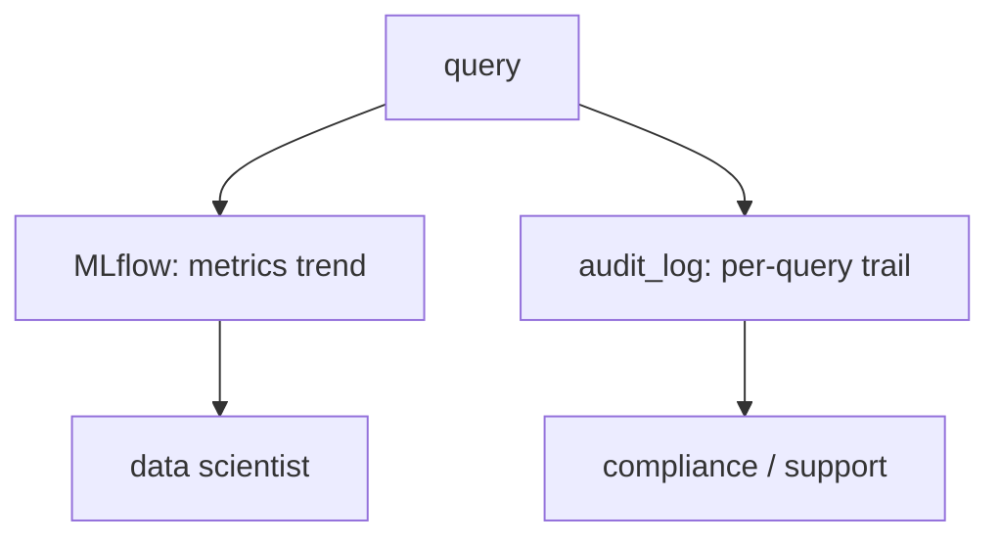

# Understand — Audit Logging & Compliance

> Why banks obsess over auditability, and how one immutable row per query delivers
> it.

---

## 1. The compliance requirement

In a regulated environment you must be able to answer, for **any** past decision:

- *Who* asked *what*, and *when*?
- What did the safety checks decide?
- What evidence (which document chunks) was used?
- What did the system output, and how confident was it?
- Was a human involved?

That is **traceability** + **explainability**. A demo that just returns an answer
cannot answer these. So every query writes one immutable audit record.



---

## 2. What's captured — `db.AuditLog`

```
query_id, tenant_id, user_id, username, question,
input_guard_passed, input_guard_json,
react_steps_json,            ← the full Thought/Action/Observation trace
retrieved_chunk_ids_json,    ← exactly which evidence was used
final_report,
output_guard_passed,
ragas_faithfulness, confidence_score,
review_status,               ← auto_approved | pending | approved | rejected | blocked
latency_ms, created_at
```

Because `query_id == job_id`, one identifier ties together the **job**, its
**streamed trace**, and its **compliance record**.

---

## 3. Audit log vs MLflow — different jobs

A common confusion. They are **complementary**, not redundant:

| | MLflow | Audit log |
| --- | ------ | --------- |
| Question | "How is the model doing over time?" | "What did the system do for query X?" |
| Granularity | experiment/run metrics | one row per query, full trail |
| Audience | ML engineers | auditors, compliance, support/debug |
| Mutable? | runs append metrics | immutable record |
| Store | `mlruns/` | `audit_log` table (SQLite/Postgres) |



---

## 4. Even rejections are audited

- A query blocked by the **input guard** still writes an audit row
  (`input_guard_passed=False`, `review_status="blocked"`). You can prove the
  system *refused* something and why.
- A flagged report records `review_status="pending"`, later updated to
  `approved`/`rejected` when a human acts — so the human decision is part of the
  permanent record.

---

## 5. Portability

Audit rows go through SQLAlchemy. Locally that's SQLite (`state/…db`); in
production change one connection URL to Postgres. JSON columns are stored as text
so the schema is portable with no JSON-type dependency.
