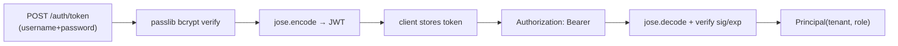
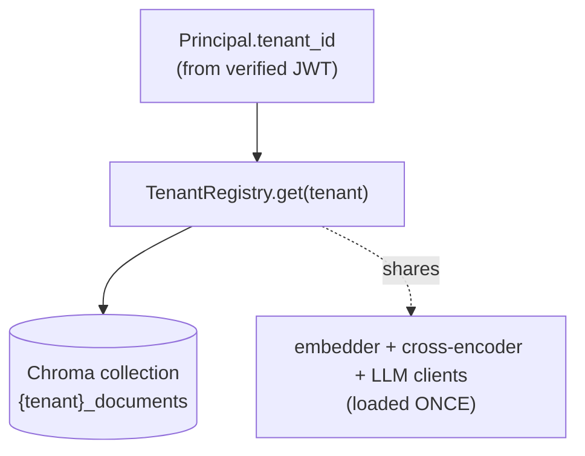

# Understand — Auth (JWT) & Multi-Tenancy

> The theory of stateless auth and tenant isolation, mapped to the code.

---

## 1. Why JWT (stateless auth)

A **JSON Web Token** is a signed, expiring claim set: `{sub, tenant, role, exp}`.
The server signs it with a secret; anyone with the secret can **verify** it
without a database lookup or session store.

**Why stateless matters here:** a Celery worker or a second API replica can verify
the same token with only the shared secret — no shared session DB. That is the
horizontally-scalable posture banks expect.

| Concern | File | Library |
| ------- | ---- | ------- |
| Hash/verify password | `auth/security.py` | `passlib[bcrypt]` |
| Mint/verify token | `auth/security.py` | `python-jose` (HS256) |
| Extract caller | `auth/dependencies.py` | FastAPI `OAuth2PasswordBearer` |
| Role gate | `auth/dependencies.py` | `require_reviewer` |

### Password security (theory)

Never store plaintext. **bcrypt** is a deliberately slow, salted hash — slow
defeats brute force, salt defeats rainbow tables. `passlib` handles both.

---

## 2. Multi-tenancy — isolation models

Three common patterns, increasing isolation:

| Pattern | Isolation | Cost |
| ------- | --------- | ---- |
| Shared table + `tenant_id` filter | logical only (app bug = leak) | cheap |
| **Separate collection per tenant** ← *we use this for vectors* | physical at store | medium |
| Separate database/cluster per tenant | strongest | expensive |

**Here:**
- **Vectors** are physically isolated — each tenant has its own ChromaDB
  collection `{tenant}_documents` (`tenancy/registry.py`,
  `tenant_collection_name`). A user literally queries a different collection, so
  cross-tenant retrieval is impossible.
- **Relational rows** (documents/jobs/audit/review) carry `tenant_id` and every
  query filters on it (defence in depth).

### The registry trick (memory)

Loading the embedder + cross-encoder per tenant would blow up RAM. The
`TenantRegistry` loads those heavy, **stateless** models **once** and shares them,
while building only the cheap **stateful** pieces (vector store, retrievers,
orchestrator) per tenant and caching them.

---

## 3. Authorisation (roles)

The token's `role` claim gates endpoints:

- `analyst` — query, ingest, view own documents/audit.
- `reviewer` / `admin` — additionally act on the review queue
  (`require_reviewer`).

---

## 4. Try the isolation yourself

1. `alice` (retail-bank) ingests a PDF and asks a question → answered.
2. `bob` (risk-team) asks the same question → **no access** to alice's chunks,
   because his queries hit `risk-team_documents`.

See [README_AUTH_TENANCY.md](../README_AUTH_TENANCY.md) for the curl commands.
