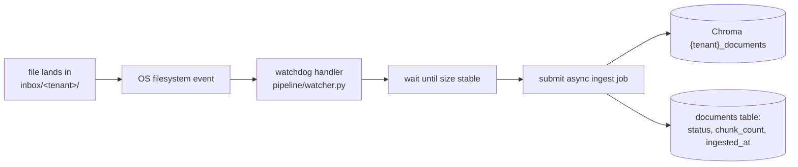

# Understand — Data Pipeline (Event-Driven Ingestion)

> Turning a one-off CLI command into a stateful, event-driven data pipeline.

---

## 1. From "manual ingest" to "pipeline with state"

The original flow was `python main.py ingest --pdfs a.pdf`. That is a script, not
a pipeline. A real pipeline is **event-driven** (reacts to data arriving) and has
**state** (knows what it ingested, when, and whether it succeeded).



---

## 2. Why event-driven (watchdog) over polling

| Approach | Cost | Latency |
| -------- | ---- | ------- |
| Cron/poll loop | wakes constantly, scans dir | up to the poll interval |
| **watchdog (events)** | idle until a file lands | near-instant |

`watchdog` subscribes to native OS notifications (ReadDirectoryChangesW on
Windows, inotify on Linux). Cross-platform — matters for laptop dev.

**The size-stability check** (`_wait_until_stable`) handles the classic race: an
event fires the instant a file is *created*, but a large upload is still being
written. We wait until the size stops changing before ingesting.

---

## 3. Tenant routing by folder

The **first path segment** under `inbox/` is the tenant id:

```
inbox/
  risk-team/basel_iii.pdf     → ingests into risk-team_documents
  retail-bank/product.pdf     → ingests into retail-bank_documents
```

Files dropped directly in `inbox/` (no tenant subfolder) are ignored — there is no
tenant to attribute them to.

---

## 4. State: the `documents` table — `db/models.py`

Every file becomes a `Document` row, updated through its lifecycle by
`core/service.run_ingest`:

```
pending → ingesting → ingested | failed
(id, filename, tenant_id, source_path, status, chunk_count, error, created_at, ingested_at)
```

This is what makes it a pipeline and not a script: you can query *what's in the
system* via `GET /documents`, see failures, and audit ingestion history.

---

## 5. It's its own service

`pipeline/watch.py` is a standalone long-running process (not part of the API). It
builds its own registry + thread-backed job manager and watches the folder. In
production this is a separate deployable that scales independently of the API.

```bash
python -m scripts.make_financial_corpus --to-inbox risk-team
python -m pipeline.watch
```

See [README_DATA_PIPELINE.md](../README_DATA_PIPELINE.md) for the run guide.
