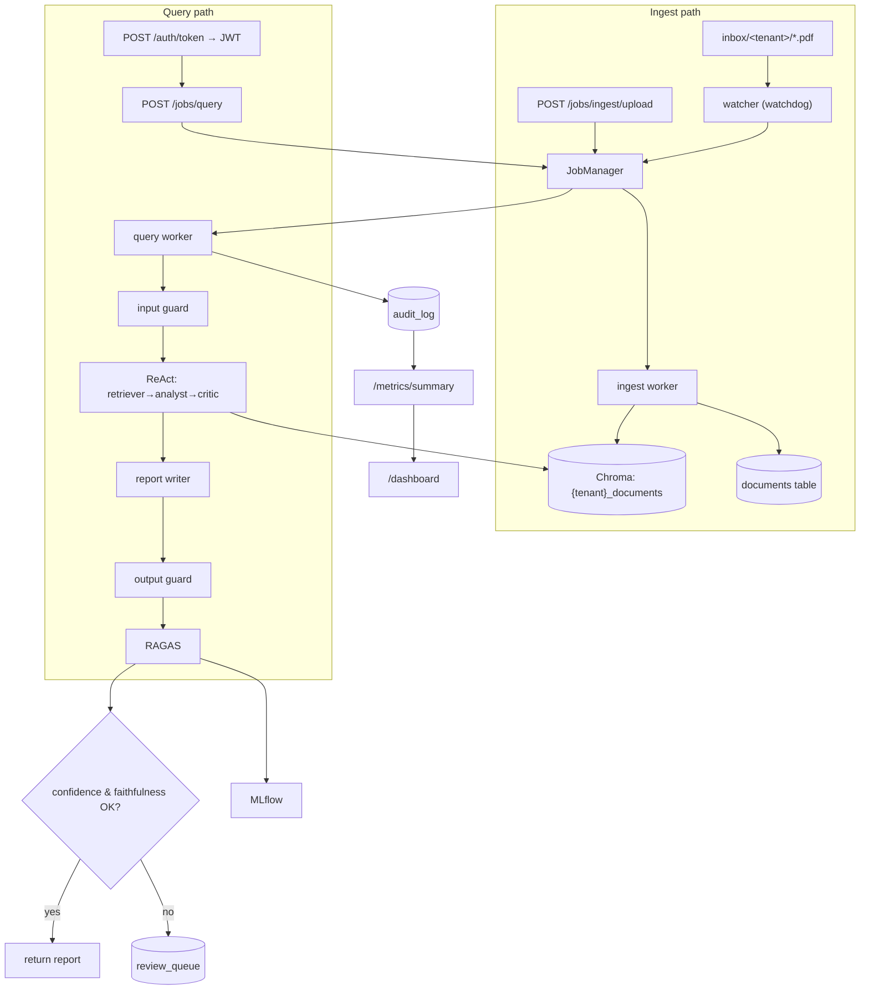

# Understand — End-to-End Architecture

> Goal of this doc: give you the mental model for *why* a "personal RAG project"
> becomes a "production system", and show exactly which files implement each idea
> so you can connect your theory to the code.

---

## 1. What "end to end" really means

A demo becomes a production system when it has **data in → business value out**,
with everything in between **observable, recoverable, and auditable**. For a bank,
add **compliance, traceability, and explainability of every decision**.

That single sentence maps to seven concrete capabilities:

| Theory concept | Production capability | Implementation |
| -------------- | --------------------- | -------------- |
| Domain fit | Financial document intelligence | `scripts/`, `config.domain` |
| Decoupling / scalability | Async job queue | `jobs/` |
| Isolation / security | Auth + multi-tenancy | `auth/`, `tenancy/` |
| Data engineering | Watched-folder pipeline | `pipeline/`, `db.Document` |
| Compliance | Structured audit log | `audit/`, `db.AuditLog` |
| Safety / governance | Human-in-the-loop review | `db.ReviewItem`, `routers/review.py` |
| Observability | Metrics + dashboard | `routers/metrics.py`, `static/dashboard.html` |

---

## 2. The whole system in one diagram

---

## 3. The request lifecycle, step by step

1. **Authenticate** (`auth/`) → JWT carrying `tenant` + `role`.
2. **Submit** `/jobs/query` (`routers/jobs.py`) → a `pending` row in `jobs`,
   returns `job_id` instantly (non-blocking).
3. **Worker picks it up** (`jobs/thread_backend.py` or Celery) → `runners.py`.
4. **Tenant pipeline** resolved from `TenantRegistry` (`tenancy/registry.py`) —
   correct Chroma collection for the tenant.
5. **Guarded pipeline** runs (`core/service.py`): input guard → ReAct
   orchestrator → report writer → output guard → RAGAS.
6. **Decision**: confidence/faithfulness gate → auto-approve or **review queue**.
7. **Audit** (`audit/logger.py`): one immutable row with the full trail.
8. **Observe**: `/metrics/summary` aggregates the audit log; `/dashboard` charts it.

---

## 4. Key architectural decisions (and the trade-offs)

| Decision | Chosen | Alternative | Why chosen (laptop-first) |
| -------- | ------ | ----------- | ------------------------- |
| State store | SQLite + SQLAlchemy | Postgres | Zero-install, one file; ORM = 1-line swap later |
| Job backend | Thread pool (default) | Celery+Redis always | No infra to run; same API; Celery is opt-in |
| Auth | JWT (jose) + passlib | OIDC provider | Stateless, runs locally; OIDC-shaped for later |
| Streaming | In-proc SSE bus | Kafka/Redis streams | Works with thread backend; no broker |
| Vector store | ChromaDB (per-tenant collection) | Pinecone/Weaviate | Local + persistent; isolation by collection |
| Agent loop | Custom ReAct | LangGraph | Inspectable/auditable plain Python |

The throughline: **every choice keeps it runnable on one laptop while preserving a
clean upgrade path to real infrastructure.**

---

## 5. Where to go next

- RAG internals → [understand_rag.md](understand_rag.md)
- The agent loop → [understand_multi_agent_react.md](understand_multi_agent_react.md)
- Each production layer has its own `understand_*` doc (see the table in the main
  [README](../../README.md)).
