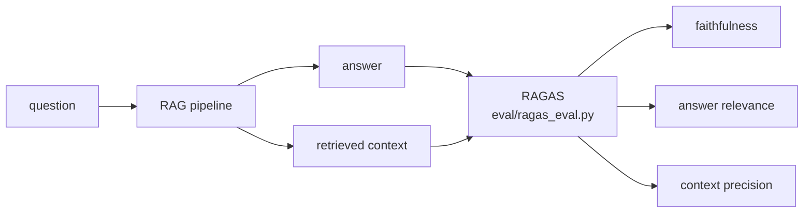
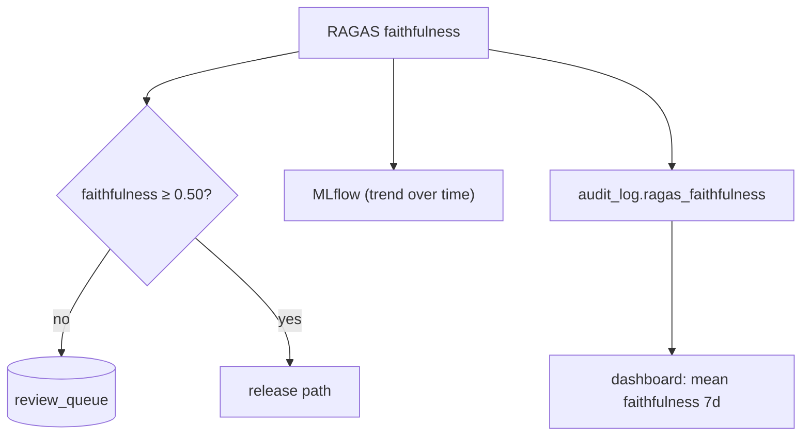

# Understand — Evaluation with RAGAS

> How we measure whether a RAG answer is *good*, and how that score drives
> behaviour.

---

## 1. Why you can't eval RAG with accuracy

There is rarely one "correct" string. A good RAG answer must be **faithful to the
retrieved context**, **relevant to the question**, and built from **precise
retrieval**. RAGAS gives reference-light, LLM-assisted metrics for exactly these.



---

## 2. The three metrics (theory)

| Metric | Question it answers | Intuition |
| ------ | ------------------- | --------- |
| **Faithfulness** | Are the answer's claims supported by the context? | Detects hallucination — claims with no grounding lower the score |
| **Answer relevance** | Does the answer actually address the question? | Penalises evasive/partial answers |
| **Context precision** | Were the retrieved chunks actually relevant? | Evaluates the *retriever*, not just the generator |

These isolate failures: low faithfulness = generator hallucinating; low context
precision = retriever fetching junk.

---

## 3. Where it runs — `eval/ragas_eval.py`

- **Per query** (`evaluate_single`) inside `core/service.py`, so every answer is
  scored in real time — not just in offline batches.
- **Batch** (`evaluate_batch`) over the golden set (`eval/golden_set.py`) for
  regression testing and CI.

RAGAS itself needs an LLM + embeddings; here it uses **local Ollama** + the same
HF embedding model, so evaluation is local too.

---

## 4. How the score is *used* (not just logged)

This is the important part — evaluation is wired into control flow:



- **Faithfulness < 0.50** → the report is held for **human review**.
- Stored in `audit_log` → drives the dashboard's **mean faithfulness (7d)** KPI.
- Logged to **MLflow** → catch regressions across experiments/time.

So RAGAS is simultaneously a **gate**, an **audit field**, and an **ops metric** —
exactly the "evaluated, observable, governed" posture production needs.

---

## 5. Thresholds (config)

```yaml
eval:
  faithfulness_threshold: 0.70
  answer_relevance_threshold: 0.65
  context_precision_threshold: 0.60
review:
  faithfulness_threshold: 0.50   # below this → human review
```

Batch eval "passes" against the `eval` thresholds; the stricter `review`
threshold is the live gate for held reports.
