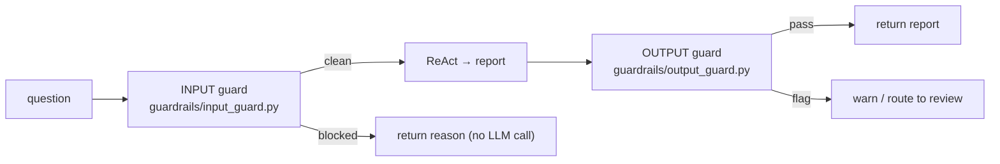

# Understand — Guardrails

> Why input/output guardrails exist, the theory behind each check, and where they
> run.

---

## 1. Two checkpoints

Guardrails are the **safety + governance** layer. The input guard protects the
*system* from bad input; the output guard protects the *user* from bad output.

---

## 2. Input guard — fail fast, fail cheap

Order matters: cheap deterministic checks first so an expensive LLM call is never
made on invalid input.

| Check | Theory | Implementation |
| ----- | ------ | -------------- |
| Prompt injection | Attacker tries to override the system prompt ("ignore previous instructions"). Detect known patterns. | keyword list in `config.guardrails.injection_keywords` |
| PII | Don't process/store sensitive identifiers; scrub them. | regex for PAN/Aadhaar/email/phone in `config.guardrails.pii_patterns` |
| Topic relevance | Reject off-topic queries (cost + abuse control). Cosine of the query vs the domain/corpus anchor. | `topic_relevance_threshold`; embeds query, compares to corpus |

The cleaned (PII-scrubbed) query is what flows downstream as `clean_query`.

> **Prompt injection** is OWASP-LLM-Top-10 #1. The keyword filter is a pragmatic
> first line; a production system adds an LLM/classifier-based detector too.

---

## 3. Output guard — ground truth before release

| Check | Theory | Implementation |
| ----- | ------ | -------------- |
| Citation grounding | Every factual sentence should be supported by a retrieved chunk. Embed each sentence, take max cosine to chunks; if too many are below threshold, fail. | `_check_citation_grounding`, `cosine_threshold=0.70`, fails if >30% ungrounded |
| Toxicity | Don't emit harmful content. | LLM yes/no check, fails open on error |
| Citations present | Reports must cite. | regex for `[Source: …]` (soft warning) |

**Why a cosine check, not another LLM call for grounding?** Latency and cost. A
lightweight embedding comparison catches hallucinated/ungrounded claims without a
second expensive generation.

---

## 4. How guardrails feed the rest of the system

- A **blocked input** is still **audited** (`input_guard_passed=False`) and counts
  toward the dashboard's **block rate** KPI.
- An **output-guard flag** is one of the triggers that routes a report to the
  **human review queue**
  ([understand_human_in_the_loop.md](understand_human_in_the_loop.md)).

So guardrails are not a dead-end "reject" — they are wired into compliance and
observability.
