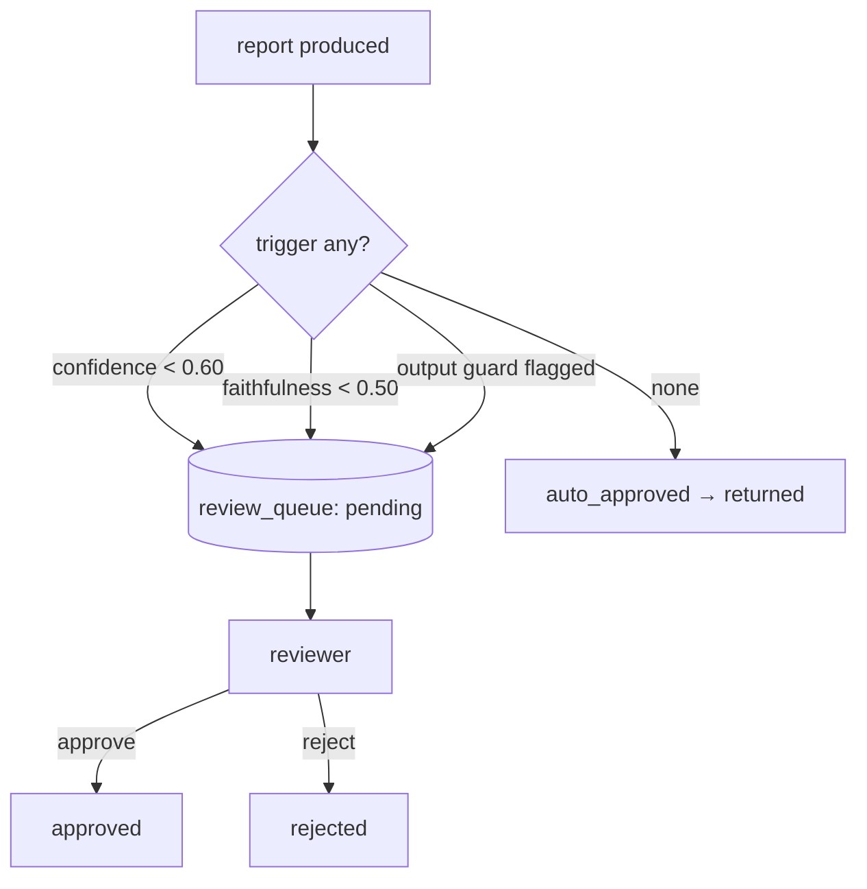

# Understand — Human-in-the-Loop Review

> Why a fully-automated agent is the wrong design for high-stakes answers, and how
> the review checkpoint works.

---

## 1. The principle: automate the confident, escalate the doubtful

In finance, a wrong-but-confident answer is worse than "a human checked this."
The system should **act autonomously when confident** and **defer to a human when
not**. The hard part is defining "not confident" *measurably* — we already produce
the signals (confidence score, RAGAS faithfulness, guard result), so we gate on
them.



---

## 2. The triggers (config-driven) — `core/service.py`

```yaml
review:
  confidence_threshold: 0.60     # report confidence below this
  faithfulness_threshold: 0.50   # RAGAS faithfulness below this
```

Plus: the **output guard** raising a flag. Any one trigger routes the report to
the queue. Thresholds live in config so risk tolerance is tunable without code
changes.

---

## 3. State machine — `db.ReviewItem`

```
pending → approved | rejected
```

| Field | Meaning |
| ----- | ------- |
| `query_id` | links back to the audit row and job |
| `reason` | which trigger fired (low confidence / faithfulness / guard) |
| `status` | pending → approved/rejected |
| `reviewer_username`, `resolved_at` | who closed it and when |

The review decision is written back to the **audit log** (`review_status`), so the
human action becomes part of the permanent compliance trail
([understand_audit_compliance.md](understand_audit_compliance.md)).

---

## 4. Who can review — role gate

Only `reviewer`/`admin` roles can act (`require_reviewer` in
`auth/dependencies.py`). The seeded `reviewer` user (risk-team) demonstrates it.

```mermaid
flowchart LR
    bob["analyst bob"] -->|submits query| q["may land in review"]
    reviewer["reviewer (role=reviewer)"] -->|GET /review/queue| list["pending items"]
    reviewer -->|POST /review/{id}/approve| close["resolved + audited"]
```

Endpoints: `GET /review/queue`, `GET /review/{query_id}`,
`POST /review/{query_id}/approve|reject` (`serve/routers/review.py`).

---

## 5. Why this is the right pattern

- **Selective**: humans only see the small fraction that's genuinely risky, so the
  system still scales.
- **Measurable**: the gate uses numbers the pipeline already computes — no extra
  model.
- **Auditable**: every escalation and resolution is recorded.

This is the difference between "a chatbot" and "a governed decision-support
system."
