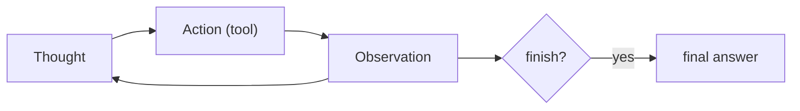
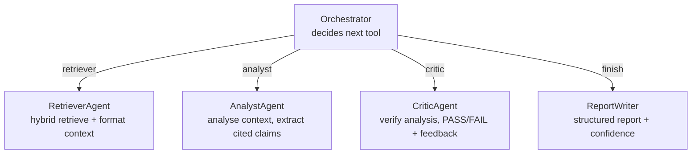

# Understand — Multi-Agent ReAct

> How the "agent" works, why it is multi-agent, and where it lives in code.

---

## 1. ReAct in one line

**ReAct = Reasoning + Acting.** Instead of answering in one shot, the LLM loops:
it writes a **Thought**, picks an **Action** (a tool), reads the **Observation**
(tool output), and repeats until it chooses `finish`. This interleaving lets it
*plan*, *use tools*, and *self-correct*.



Implemented as a **pure-Python loop** in `agents/orchestrator.py`
(`run_with_callback`), not LangGraph — so every step is inspectable and auditable.

---

## 2. Why multi-agent (separation of concerns)

A single mega-prompt that retrieves, analyses, *and* self-critiques tends to be
mediocre at all three. Splitting into specialists with narrow jobs is more
reliable and easier to debug:



| Agent | File | Job |
| ----- | ---- | --- |
| Orchestrator | `agents/orchestrator.py` | Runs the ReAct loop, routes actions |
| Retriever | `agents/retriever_agent.py` | Calls the hybrid reranker, formats context |
| Analyst | `agents/analyst_agent.py` | Produces a cited analysis from context |
| Critic | `agents/critic_agent.py` | Verifies the analysis, can force a revision |
| Report writer | `agents/report_writer.py` | Final structured report + confidence score |

The **critic** is the "reflection"/self-correction pattern: if it fails the
analysis, the orchestrator can re-analyse before finishing.

---

## 3. The parsing contract

The orchestrator constrains the LLM to emit exactly:

```
Thought: <reasoning>
Action: <retriever | analyst | critic | finish>
Action Input: <input>
```

`_parse_action` extracts these with regex. If parsing fails or the action is
invalid, it safely falls back to `finish` (no infinite loops). `max_react_steps`
(config, default 6) is a hard ceiling.

---

## 4. State passed between steps

`self._context` accumulates `formatted_context`, `analysis`, `feedback`, and
`retrieved_chunks` across steps, and is reset per query. The returned `trace` (a
list of step dicts) is what gets:

- **streamed** live over SSE (`step_callback` → `jobs/stream.py`), and
- **stored** in the audit log (`react_steps_json`) for traceability.

That trace is the bridge between the agent concept and the **auditability**
requirement — see
[understand_audit_compliance.md](understand_audit_compliance.md).

---

## 5. Why custom over a framework

| Want | Custom loop gives you |
| ---- | --------------------- |
| Explain every decision | Each Thought/Action/Observation is plain data |
| Audit/compliance | Trivial to serialise the trace into `audit_log` |
| Stream tokens/steps | A simple callback hook (`step_callback`) |
| No hidden magic | No framework-specific abstractions to reverse-engineer |
