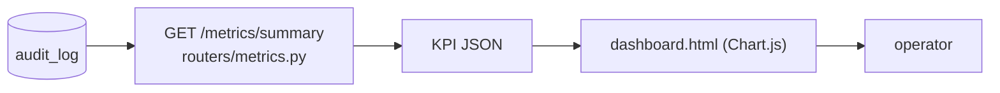
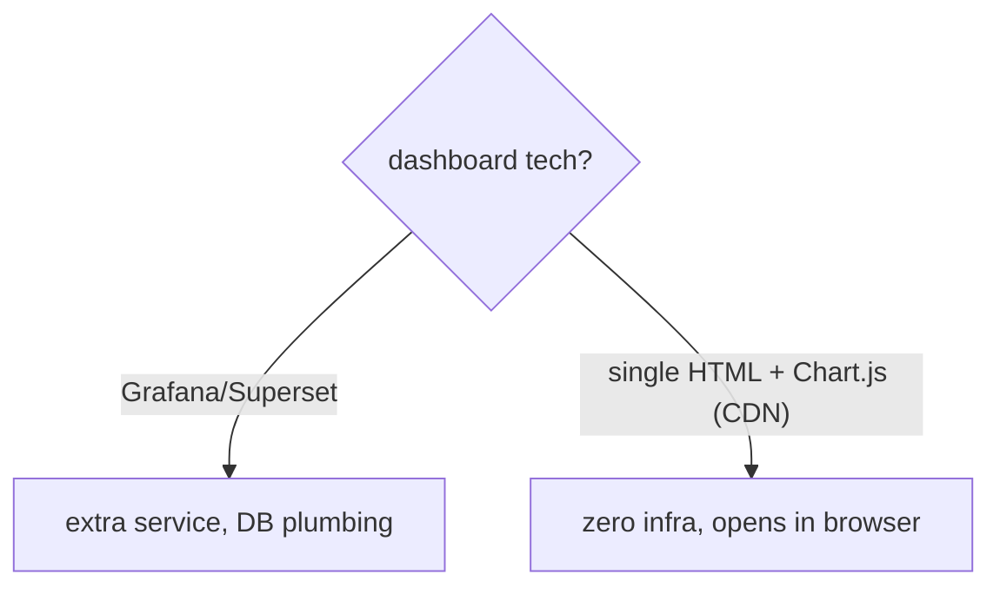

# Understand — Observability & Monitoring

> You can't operate what you can't see. How the audit trail becomes a live
> dashboard.

---

## 1. The three pillars (and where we sit)

| Pillar | Question | Here |
| ------ | -------- | ---- |
| **Metrics** | aggregate trends/KPIs | `GET /metrics/summary` from `audit_log` |
| **Logs/traces** | what happened in one request | audit log + ReAct trace |
| **Dashboards** | human-readable view | `serve/static/dashboard.html` |

We get observability "for free" because every query already writes a rich audit
row — the metrics endpoint just **aggregates** that table.

---

## 2. The KPIs and why they matter

| KPI | Derived from | Tells you |
| --- | ------------ | --------- |
| Queries / hour | `count(created_at)` bucketed | load / usage |
| Mean confidence | `avg(confidence_score)` | answer quality trend |
| Mean faithfulness (7d) | `avg(ragas_faithfulness)` | hallucination trend |
| Block rate | input-guard fails / total | abuse / misuse signal |
| Review backlog | `review_status='pending'` count | human-load / risk signal |
| Avg latency | `avg(latency_ms)` | performance / SLO |

A drop in faithfulness or a spike in block rate is an early warning that something
(corpus, model, or users) changed.

---

## 3. Why a single-file dashboard

Given the "runs on my laptop" constraint, `dashboard.html` is one static file:
it logs in (reusing the JWT flow), calls `/metrics/summary`, and renders KPIs +
charts with Chart.js from a CDN. No Grafana, no separate datastore. The *shape* of
the data (a metrics API over the audit table) is identical to what you'd feed a
real BI tool — so swapping to Grafana later is a front-end change, not a re-architecture.

---

## 4. The flow end to end

1. User runs queries → each writes an `audit_log` row.
2. `GET /metrics/summary` aggregates the last N days.
3. `GET /dashboard` serves the HTML; it fetches the summary and draws charts.
4. Operator watches trends; the **review backlog** KPI links straight to the
   human-in-the-loop queue.

Served by `serve/routers/metrics.py`; see
[README_DASHBOARD.md](../README_DASHBOARD.md) for the run guide (default login
`bob/risk123`).
