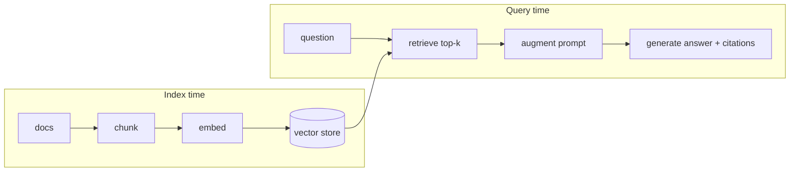
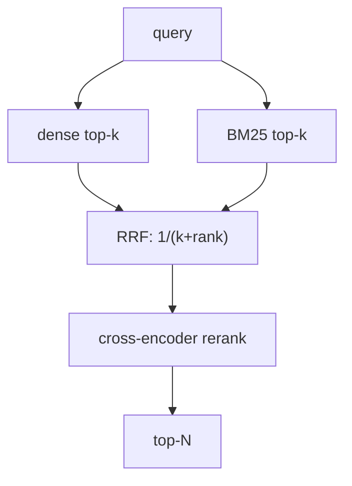

# Understand — Retrieval-Augmented Generation (RAG)

> Connect the RAG theory you know to the exact files here.

---

## 1. The core idea

An LLM only knows its training data. **RAG** injects *relevant, retrieved* text
into the prompt at inference time so the model answers from **your** documents
and can **cite** them. Three phases:



---

## 2. Chunking — `ingestion/chunker.py`

**Theory:** embeddings degrade on long text; retrieval needs passage-sized units.
Too small → lost context; too large → diluted similarity.

**Here:** sentence-aware chunks of `chunk_size=300` with `chunk_overlap=50`
(config), extracted with PyMuPDF which preserves **page numbers** — that is what
makes `[Source: file.pdf, Page: N]` citations possible.

---

## 3. Embeddings — `ingestion/embedder.py`

**Theory:** a bi-encoder maps text → a dense vector; similar meaning → nearby
vectors (cosine). Fast because each text is encoded **independently** and indexed.

**Here:** `all-MiniLM-L6-v2` (384-dim). Chosen for being small, CPU-friendly, and
a strong recall/size trade-off — ideal for a laptop.

---

## 4. Vector store — `ingestion/vector_store.py`

**Theory:** an Approximate Nearest Neighbour (ANN) index makes top-k search over
millions of vectors sub-linear (HNSW graph here).

**Here:** ChromaDB persistent client, `hnsw:space=cosine`. In the multi-tenant
build each tenant gets its **own collection** `{tenant}_documents`
(see [understand_auth_jwt_multitenancy.md](understand_auth_jwt_multitenancy.md)).

---

## 5. Hybrid retrieval — `retrieval/dense.py`, `sparse.py`, `reranker.py`

**Theory:**
- **Dense** (bi-encoder) captures *semantics* but can miss exact tokens.
- **Sparse** (BM25) captures *exact terms* (e.g. "CRAR", "CET1") but not meaning.
- **Fusion** combines both. **Reciprocal Rank Fusion (RRF)** scores each doc as
  $\sum_i \frac{1}{k + \text{rank}_i}$ — rank-based, so no weight tuning and
  robust to different score scales.



**RRF math (in `_reciprocal_rank_fusion`)** uses `k=60` (the original paper's
constant) so high ranks dominate but lower ranks still contribute.

---

## 6. Cross-encoder reranking — `retrieval/reranker.py`

**Theory:** a **cross-encoder** feeds *(query, passage)* together through the
transformer, attending jointly — far more accurate than cosine on independent
embeddings, but $O(N)$ inferences so only used on the fused shortlist.

**Here:** `cross-encoder/ms-marco-MiniLM-L-6-v2` reranks the fused candidates,
returns the top `reranker_top_n=5`. In `tenancy/registry.py` this model is loaded
**once and shared** across tenants to save memory.

This is the classic **retrieve-then-rerank** two-stage design: cheap recall first,
expensive precision second.

---

## 7. Generation — `agents/report_writer.py` / `standalone/rag_minimal.py`

The top-N chunks are stuffed into the prompt with their source tags; the LLM
(Ollama `mistral`) must answer **only** from context and cite every claim. The
output guard later verifies those claims are actually grounded
([understand_guardrails.md](understand_guardrails.md)).

---

## 8. See it in isolation

`standalone/rag_minimal.py` is the pure RAG path with **no** agents/guards/DB:

```bash
python -m standalone.rag_minimal ingest --dir sample_pdfs/financial
python -m standalone.rag_minimal ask --question "What is the minimum CRAR?"
```

Read that file top-to-bottom — it is ~150 lines and is the whole RAG concept made
concrete.
